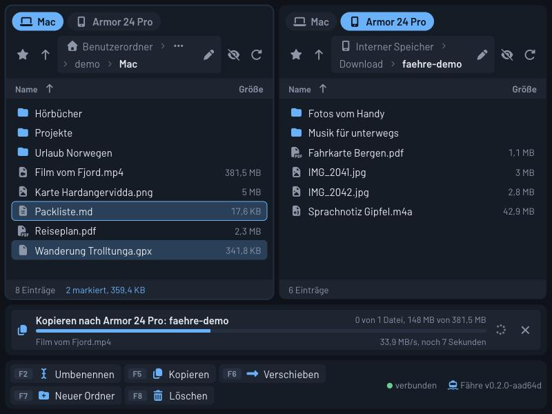

# Fähre

Dateiaustausch zwischen Mac und Android-Telefon im Browser. Zwei Ordnerseiten nebeneinander, Dateien per Drag & Drop hin- und herschieben, dazu Tastatursteuerung nach dem Vorbild klassischer Zwei-Fenster-Dateimanager.



## Was Fähre kann

- **Zwei Ordnerseiten**, jede zeigt wahlweise den Mac oder ein angeschlossenes Telefon
- **Drag & Drop** zwischen den Seiten (kopieren, mit gedrückter ⌘-Taste verschieben), auf Ordner in der Liste und aus dem Finder hinein, auch ganze Ordner
- **Einzelne Dateien in den Finder ziehen** (Chromium-Browser)
- **Rechtsklick-Menü** auf Dateien, Ordner und freie Fläche
- **Übertragungen im Hintergrund** mit Fortschritt, Tempo, Restzeit und Abbrechen
- **Rückfrage bei vorhandenen Namen**: überschreiben oder überspringen
- **Änderungsdatum bleibt erhalten**, in beide Richtungen
- **Löschen auf dem Mac in den Papierkorb**; auf dem Telefon endgültig, mit deutlichem Hinweis
- **SD-Karte** und wichtige Ordner über den Schnellzugriff (Stern)
- **Neue Bilder und Musik** erscheinen sofort in Galerie und Player des Telefons
- **Große Ordner** werden seitenweise beim Rollen nachgeladen
- **Geräteerkennung**: das Telefon erscheint beim Einstecken von selbst, fehlende Freigaben werden angezeigt

## Einrichtung

```bash
bash tools/einrichten.sh
```

Das Skript prüft jeden Schritt und überspringt, was schon da ist. Auf einem frischen Mac installiert es Homebrew, adb, uv und Node.js, richtet Backend und Oberfläche ein, legt die `.env` mit freien Ports an und aktiviert die Git-Haken.

Am Telefon einmalig:

1. Einstellungen > Über das Telefon > 7-mal auf "Build-Nummer" tippen
2. Einstellungen > System > Entwickleroptionen > "USB-Debugging" einschalten
3. Kabel direkt am Mac anstecken und "USB-Debugging zulassen" bestätigen

## Starten und Beenden

```bash
./start.sh
```

```bash
./stop.sh
```

`start.sh` richtet beim ersten Mal automatisch ein, startet Backend und Oberfläche und öffnet den Browser. Protokolle liegen unter `.run/`. Jede Dateiänderung (Löschen, Umbenennen, Aufträge) steht dort mit vollständigem Pfad.

## Bedienung

| Taste | Wirkung |
|---|---|
| Tab | Zwischen den Seiten wechseln |
| ↑ ↓, Bild auf/ab, Pos1, Ende | Bewegen, mit Umschalt markieren |
| Eingabe | Ordner öffnen |
| Rücktaste | Übergeordneter Ordner |
| Leertaste | Markieren und weiter |
| ⌘A, Escape | Alles markieren, Markierung aufheben |
| F2 | Umbenennen |
| F5 | In den Ordner der anderen Seite kopieren |
| F6 | In den Ordner der anderen Seite verschieben |
| F7 | Neuer Ordner |
| F8, Entf, ⌘⌫ | Löschen |

Die F-Tasten brauchen auf dem Mac je nach Einstellung zusätzlich die fn-Taste. Alle Befehle gibt es auch als Knöpfe in der Fußleiste und im Rechtsklick-Menü.

## Aufbau

```
backend/    FastAPI, Python 3.12+, verwaltet mit uv
  quellen/  Schnittstelle Dateiquelle mit Umsetzungen für Mac und Android (adb)
  dienste/  Aufträge, Ereignisverteiler, Sortierung und Seiten
  routen/   HTTP-Schnittstelle, Ereignisse per Server-Sent Events
frontend/   Svelte 5, TypeScript, Vite
tools/      Einrichtung, Versionierung, Git-Haken
```

Die Version steht ausschließlich in `version.json`. Der Git-Haken zählt sie bei jedem Commit hoch. Backend und Oberfläche lesen sie von dort und zeigen sie in der Fußleiste an. Läuft im Backend eine neuere Version als im geöffneten Browser-Tab, bietet die Oberfläche das Neuladen an.

Tests:

```bash
cd backend && uv run pytest
```

```bash
cd frontend && npm run check
```

## Lizenz

**Nicht-kommerzielle Nutzung** - Siehe [LICENSE](LICENSE)

Erlaubt: Private Nutzung, Installation, persönliche Anpassungen, Teilen mit Quellenangabe

Verboten: Kommerzielle Nutzung, Verkauf, Einbindung in kommerzielle Produkte

---

## Unterstützen

Fähre ist ein privates Hobby-Projekt. Kein Tracking, keine Werbung, keine Kompromisse.

Wenn dir das Projekt gefällt, kannst du es weiterempfehlen oder Verbesserungen vorschlagen - oder direkt hier:

[](https://ko-fi.com/HalloWelt42)

**Crypto:**

| Coin | Adresse |
|------|---------|
| BTC | `bc1qnd599khdkv3v3npmj9ufxzf6h4fzanny2acwqr` |
| DOGE | `DL7tuiYCqm3xQjMDXChdxeQxqUGMACn1ZV` |
| ETH | `0x8A28fc47bFFFA03C8f685fa0836E2dBe1CA14F27` |

Copyright (c) 2025-2026 HalloWelt42
